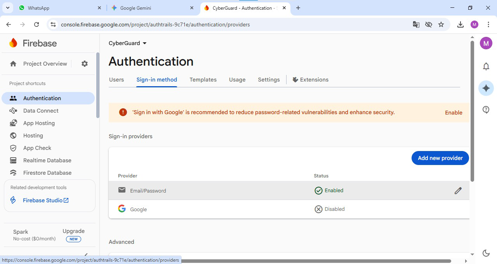
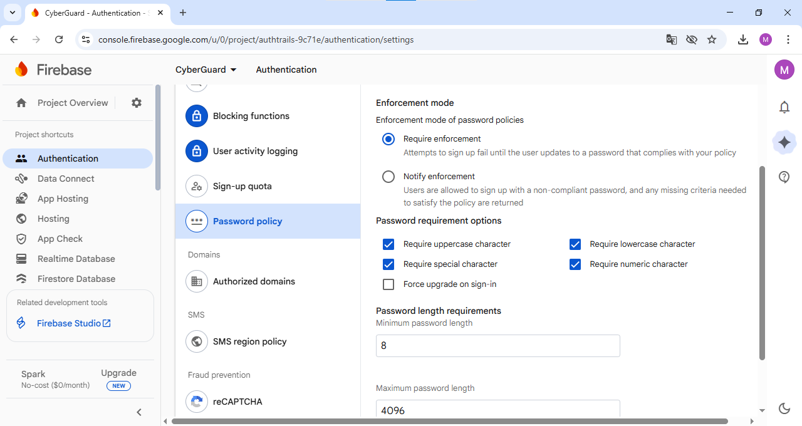
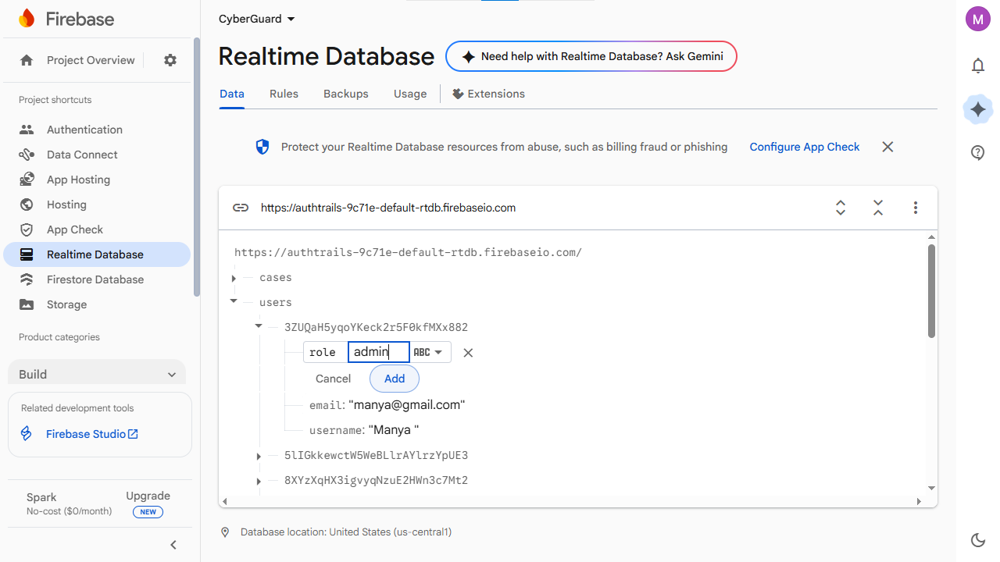

# 🛡️ CyberGuard: Secure Digital Complaint Management

**CyberGuard** is a secure digital platform designed to empower citizens to report cybercrimes efficiently while providing authorities with a centralized administrative dashboard to manage, prioritize, and resolve cases in real-time.

## 🎥 Demo Video
[Click here to watch the project demo](https://youtu.be/KrTlFL26SKw)

## 🔗 Live Project Link

👉 Click here to view the live project:  
(https://authtrails-9c71e.web.app/)

## 🔑 Demo Credentials

The following demo credentials are provided for project evaluation and testing purposes:
**Email:** admin@cyberguard.in  
**Password:** Admin@1234  

These credentials allow access to both the **Admin Dashboard** and **User Dashboard**.

**Disclaimer:**  
The above email ID is not genuine. Users are advised to register using a valid email address to fully utilize all user-specific features.

---
## 🚀 Vision
In an era of rising digital threats, transparency and speed are critical. CyberGuard bridges the gap between victims and law enforcement by automating the reporting process and providing professional-grade tracking for every case.

## ❗ Problem Statement
Cybercrime victims often face delayed reporting, lack of transparency, and no structured way to track complaint progress. Traditional systems are fragmented, manual, and inaccessible to the public.

## ✅ Solution Overview
CyberGuard enables citizens to file cybercrime complaints online, track their progress in real time, and download official complaint records. Authorities manage cases through a centralized dashboard with role-based access control and real-time status updates.

## ✨ Key Features

### For Users (Citizens)
* **Intuitive Reporting:** A streamlined form to file complaints with unique, timestamped Case IDs.
* **Real-time Tracking:** Check the live status of a complaint (Pending, In Review, Resolved, Closed) using a dedicated tracking portal.
* **Auto-Populated Profiles:** Secure login system that remembers user details for faster reporting.
* **Report Generation:** Users can generate and download a professional PDF summary of their filed cases for legal or personal records.

### For Administrators (Authorities)
* **Centralized Dashboard:** An "Administrative command Center" view of all incoming cases.
* **Status Management:** Update case progress instantly to keep the public informed.
* **Data Export:** Export all case data to CSV for offline analysis and reporting.
* **Role-Based Access:** Strict admin-only login protected by Firebase Authentication and database role checks.

---

## 🛠️ Tech Stack

| Layer | Technology |
| :--- | :--- |
| **Frontend** | HTML5, CSS, JavaScript |
| **Design** | Google Fonts (Orbitron & Inter), Custom Cyber-Theme CSS |
| **Backend** | Firebase Realtime Database |
| **Authentication** | Firebase Auth (Email/Password) |
| **Tools Used** | Visual Studio Code, GitHub, OBS Studio |
| **Hosting** | Firebase Hosting |
| **Runtime Tools** | Node.js (Firebase CLI only) |
---

## 📸 System Architecture

  * CyberGuard follows a client-server architecture where the frontend communicates directly with Firebase services. 
  * Authentication is handled using Firebase Auth, while complaint and user data are stored securely in the Firebase Realtime Database.
  * Admin access is controlled through role-based verification at both UI and database levels.
  * All interactions occur via Firebase SDKs securely


## 📋 Prerequisites :--
  To run or develop this project, you need:

**Firebase Project** : An active Firebase project with Authentication and Realtime Database enabled.
**Code Editor**: [VS Code](https://code.visualstudio.com/) is recommended.
**Node.js** (LTS version) :-
    Required to install and use the Firebase Command Line Interface (CLI).
**Latest Web Browser**: Chrome, Edge, or Firefox (needed for Firebase SDK compatibility).
**Internet Connection**: A stable internet connection to:
 * Connect with Firebase services
 * Deploy the application using Firebase CLI


## 🔧 Installation & Setup

1.  **Clone the repository**
    ```
    git clone [https://github.com/your-username/CyberGuard.git](https://github.com/your-username/CyberGuard.git)
    cd CyberGuard
    ```

2.  **Firebase Configuration**
  **Firebase has already been configured & added this project, if you need to configure & add your own (it is necessary for acquirung ADMIN ACCESS of both FIREBASE REALTIME DATABASE & CYBERGUARD ADMIN DASHBOARD) you may follow these steps**
    * Create a project on [Firebase Console](https://console.firebase.google.com/).
    * Enable **Authentication** (Email/Password) and **Realtime Database**.
    * Password Constraints can be enforced fron Firebase from Build -> Authentication -> Under Settings tab -> Password Policy -> Enable Require Enforcements & Check mark constraints for uppercase, lowercase, numeric and special characters also set minimum length to 8 characters.
    * Update the `firebaseConfig` object in `main.js` with your own credentials:
    ```javascript
    const firebaseConfig = {
    apiKey: "YOUR_API_KEY",
    authDomain: "YOUR_AUTH_DOMAIN",
    databaseURL: "YOUR_DATABASE_URL",
    projectId: "YOUR_PROJECT_ID",
    storageBucket: "YOUR_STORAGE_BUCKET",
    messagingSenderId: "YOUR_MESSAGING_SENDER_ID",
    appId: "YOUR_APP_ID"
    };
    ```
    ### 🔐 FireBase Authentication Page


    ### 🔑 Password Constraints


4. **Firebase Realtime Database Rules**
   
    **Assumptions**
        Users authenticate using Firebase Auth
        Complaints are stored under /complaints
        User profile/role stored under /users/{uid}
        Admin role: "role": "admin"
   
    **Database Rules Structure**
{
  "rules": {
    "users": {
      "$uid": {
        ".read": "auth != null && auth.uid == $uid",
        ".write": "auth != null && auth.uid == $uid"
      }
    },
    "cases": {
      ".read": "auth != null",
      ".write": "auth != null",
      ".indexOn": ["caseId", "userEmail"]
    }
  }
}


6. **Creating an Admin User**
  * The Admin Login/Dashboard checks for a `role: "admin"` flag in the database before granting access.
  **Steps to create an Admin User :-**
  * For security reasons, there is NO OPTION TO CREATE an ADMIN USER directly from the FRONTEND.
  * STEP 1- Register as a normal User.
  * STEP 2- Open Firebase Console -> Go to Build -> Click on Realtime Database.
  * STEP 3- Under Data Tab -> Click on the small arrow alongside 'users' (present below the database link).
  * STEP 4- Find the created user by clicking the arrow alondside alphanumeric ID of the records.
  * STEP 5- Click on the plus '+' icon (on right of the alphanumeric ID), in key box type 'role' & in value box type 'admin', then click on 'Add' option.
  * Now THE USER HAS BEEN GRANTED THE admin acces, he/she can now access the ADMIN DASHBOARD.

    ### 👮 Admin Creation Page


5. **Install Node.js**
  Download from: https://nodejs.org
  Install LTS Version


6.  **Deployment**
    CyberGuard is deployed using Firebase Hosting.
        ```
        npm install -g firebase-tools
        firebase login
        firebase init
        firebase deploy
        ```
    - Deployed on Firebase Hosting with HTTPS enabled by default
    - Continuous deployment supported via Firebase CLI
       
---

## 📂 Repository Structure

* `index.html`: Project landing page.
* `SignUp.html` / `LogIn.html`: User onboarding flow.
* `user.html`: Personal dashboard for citizens.
* `complaint.html`: The core crime reporting interface.
* `track.html`: Public-facing case tracking tool.
* `AdminDashboard.html`: Secure panel for law enforcement.
* `main.js`: Core logic for Firebase initialization and shared functions.
* `complaint.js`: Specific logic for case ID generation and data submission.

---
## Implementation Summary

- Users authenticate using Firebase Authentication
- Complaint data is securely stored in Firebase Realtime Database
- Each complaint receives a unique complaint ID
- Admin updates complaint status via dashboard
- Users track complaints and download complaint PDFs

## 🛡️ Security Implementation
* **Private Admin Routes:** The Admin Dashboard checks for a `role: "admin"` flag in the database before granting access.
* **Data Validation:** Sanitized inputs on the complaint form to prevent database clutter.

---
*Created for [CodeFront 2.0 Hackathon] 2026.*  

